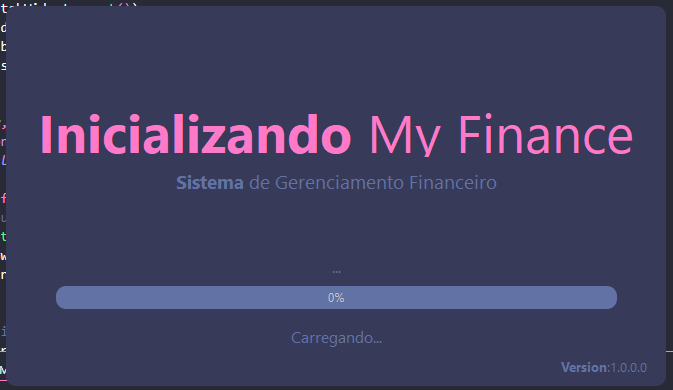
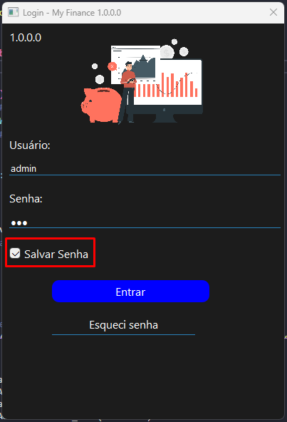
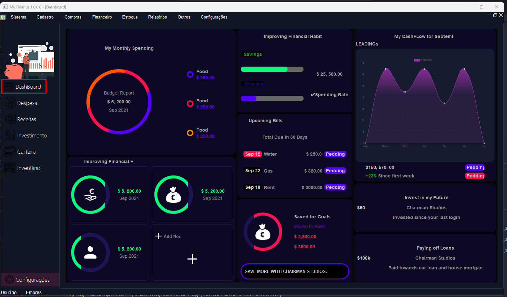
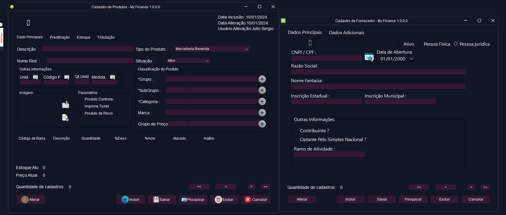

# Título do Projeto

Sistema de gerenciamento.


## Rodando localmente

Clone o projeto

```bash
  git clone https://github.com/Locked666/My-Finance-QtDesigner.git
```

Entre no diretório do projeto

```bash
  cd My-Finance-QtDesigner 
```

Instale as dependências

```bash
  pip install -r requeriments.txt
```

Inicie o arquivo principal

```bash
  python .\src\main.py
```


## Documentação dos diretórios

```bash
My_Finance_QTDesigner/
│
├── src/                  # Código-fonte do projeto
│   ├── main.py           # Arquivo principal da aplicação
│   ├── ui/               # Arquivos .py gerados a partir dos .ui
|   |   ├── backup        # Backup dos Arquivos 
│   │   ├── tela_principal.py
│   │   └── outra_tela.py
│   ├── resources/        # Recursos adicionais (imagens, ícones, etc.)
│   │   ├── imagem1.png
│   │   └── icone.ico
│   └── widgets/          # Widgets personalizados (opcional)
│       ├── meu_widget.py
│       └── outro_widget.py
│
├── ui/                   # Arquivos .ui criados no Qt Designer
│   ├── tela_principal.ui
│   └── outra_tela.ui
│
├── assets/               # Outros arquivos estáticos
│   ├── estilos.qss       # Arquivo de estilos (QSS)
│   └── README.md         # Documentação do projeto
│
└── requirements.txt      # Dependências do projeto
```
## Informações Adicionais.

* Foi criado um código para realizar a conversão automáticas dos arquivos .ui para .py:
```bash
    python func_deploy.py
```

## Ultimas Atualizações: 

* Adicionado Tela com progressBar que verifica itens necessários para funcionamento do sistema


* Adicionado opção de salvar usuário na entrada, se deixar marcado ele salva/substituir se desmarcar ele exclui os dados salvos


* Adicionado Menu Lateral com as imagens e dashboard configurado.


* Adicionado a opção de multi telas no sistema.


* Outras Funções adicionadas 

- Consulta de CNPJ; 
- next e back de cadastro pelos butões de nav


